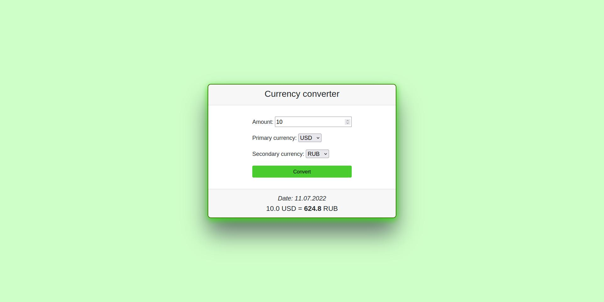

<h1 align="center"> Currency converter </h1>

<p align="center">
  <a href="https://github.com/Yu-Leo/currency-converter/blob/main/LICENSE" target="_blank"> </a>
  <a href="https://github.com/Yu-Leo/currency-converter/releases/latest" target="_blank"> </a>
  <a href="https://github.com/Yu-Leo/currency-converter/commits/main" target="_blank"> </a>
  <a href="https://github.com/Yu-Leo/currency-converter/graphs/contributors" target="_blank"> </a>
</p>

<hr>

## Navigation

* [Project description](#chapter-0)
* [Interface](#chapter-1)
* [Getting started](#chapter-2)
* [Source code](#chapter-3)
* [License](#chapter-5)

<a id="chapter-0"></a>

## :page_facing_up: Project description

Simple currency converter website.

<a id="chapter-1"></a>

## :camera: Interface



<a id="chapter-2"></a>

## :hammer: Getting started

1. Download this repository
    * Option 1
        1. Install [git](https://git-scm.com/download)
        2. Clone this repository
        ```bash
        git clone https://github.com/Yu-Leo/currency-converter.git
        cd currency-converter
        ```
    * Option 2 - [Download ZIP](https://github.com/Yu-Leo/currency-converter/archive/refs/heads/main.zip)
2. Set the values of the [required environment variables](#envvars)
    - Create `.env` file with values for **production** mode
    - Create `.env.dev` file with values for **development** mode

Now you can:

- Run in **production** mode using docker-compose
- Run in **development** mode using docker-compose
- Setting up for development and run on a local machine

### Run in **production** mode using docker-compose:

```bash
docker-compose up --build
```

### Run in **development** mode using docker-compose:

```bash
docker-compose -f docker-compose.yaml -f docker-compose.dev.yaml up --build
```

### Setting up for development and run on a local machine:

1. Create a virtual environment in the project repository
    ```bash
    python3 -m venv venv
    ```
2. Activate the virtual environment
    ```bash
    source venv/bin/activate
    ```
3. Install project dependencies
    ```bash
    pip install -r requirements.txt
    ```
4. Run Docker container with Redis
   ```bash
   docker run -p 6379:6379 redis:7.0-alpine 
   ```
5. Run the server on a local machine
    ```bash
    python3 converter/manage.py runserver
    ```

<a id="chapter-3"></a>

## :computer: Source code

### :books: [Technical documentation](./docs/README.md)

### :wrench: Technologies

#### BackEnd:

- DBMS: **Redis**
- Programming language: **Python (3.10.4)**
- Frameworks and libraries:
    - **Django 4**
    - **Requests**
    - **Redis**

#### FrontEnd:

- Languages: **HTML**, **CSS**
- Frameworks and libraries:
    - **Bootstrap 5**

#### Tools:

- **Docker** and **Docker Compose**

### :wrench: Settings

<a id="envvars"></a>

#### Required environment variables:

- `DJANGO_DEBUG` - Run in DEBUG mode or not (set 1 or 0). Default 0.
- `DJANGO_SECRET_KEY` - SECRET_KEY for the Django config
- Settings for Redis:
    - `REDIS_HOST` - redis host (`redis` for run using docker-compose and `127.0.0.1` for run on a local
      machine)
    - `REDIS_PORT` - redis port (default `6379`)
    - `REDIS_DB` - database index (default `0`)

#### services/settings.py

- `EXCHANGE_RATE_API_URL` - link to the exchange rate API

### :coffee: Tests

Run all tests (run in the outer `converter` folder):

```bash
./manage.py test converter.tests
```

Using `coverage`:

```bash
coverage run ./manage.py test converter.tests
```

With report page generation:

```bash
coverage run ./manage.py test converter.tests && coverage html
```

<a id="chapter-5"></a>

## :open_hands: License

Author: [Yu-Leo](https://github.com/Yu-Leo)

[GNU General Public License v3.0](./LICENSE)

If you use my code, please put a star ⭐️ on the repository
