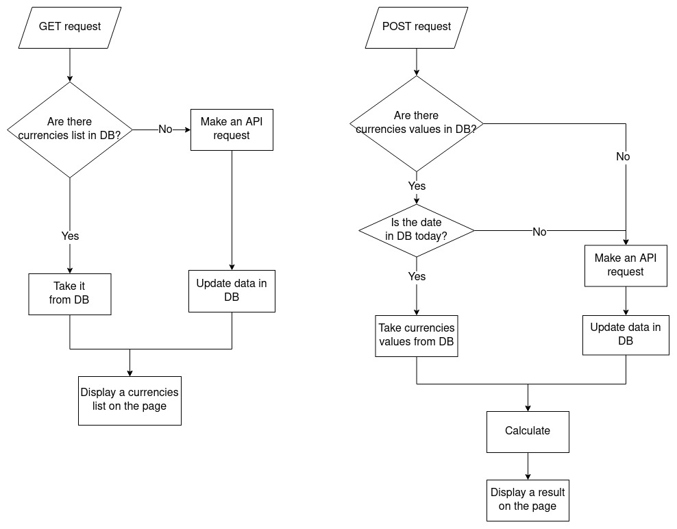
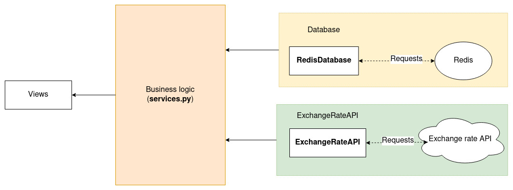
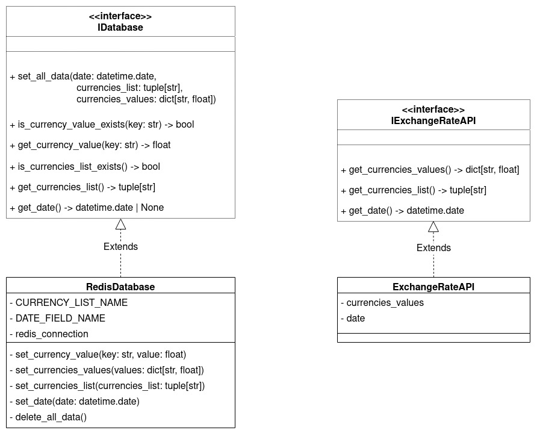
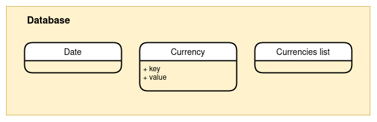

# Technical documentation of the "Currency converter" project

## :page_facing_up: Description

Simple currency converter website using Django framework.

### Logic:

If there are any errors in getting list of exchange rates from database, backend don't use it and getting data from API.

If there are any errors in getting list of exchange rates from exchange rate API, backend shows the user a page with
information that an error has occurred

### Exchange Rate API

Service: [exchangerate-api.com](https://www.exchangerate-api.com/)

Request: `https://api.exchangerate-api.com/v4/latest/USD`

## :orange_book: Architecture

### Modules

### Classes

## :blue_book: Database schema

## :file_folder: Folders and files

- **converter** - project source code
    - **config** - folder with project settings
    - **templates** - folder with templates (`.html`)
    - **static** - folder with static files
    - **converter** - the main Django application of the project
        - **migrations** - migration files
        - **services** - business logic of the application and classes for working with database and API
        - **tests.py** - tests for application
        - **exceptions.py** - custom exceptions
        - **forms.py** - forms and their settings
        - **urls.py** - application URL settings
        - **views.py** - controllers
- **docs** - documentation
- **docker-compose.dev.yaml** - docker-compose config for **development**
- **docker-compose.yaml** - docker-compose config for **production**
- **Dockerfile.dev** - docker config for **development**
- **Dockerfile** - docker config for **production**

## :arrow_left: [Back to README](../README.md)