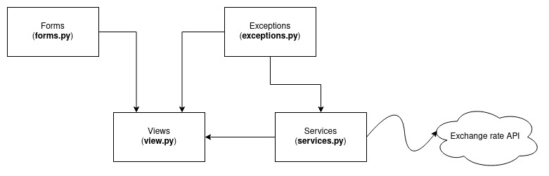

# Currency converter documentation

## :page_facing_up: Description

Simple currency converter website using Django framework.

### Logic:

#### User sends GET request

- Backend sends request to exchange rate API and gets list of exchange rates
- Backend shows received list of currencies to the user

#### User sends POST request

- Backend sends request to exchange rate API and receives list of exchange rates
- Backend calculate result
- Backend shows result to the user

If there are any errors in getting list of exchange rates from exchange rate
API, backend shows the user a page with information that an error has occurred

## Architecture

## :file_folder: Folders and files

- **converter** - project source code
    - **config** - folder with project settings
    - **templates** - folder with templates (`.html`)
    - **static** - folder with static files
    - **converter** - the main Django application of the project
        - **migrations** - migration files
        - **services.py** - business logic of the application
        - **tests.py** - tests for application
        - **exceptions.py** - custom exceptions
        - **forms.py** - forms and their settings
        - **urls.py** - application URL settings
        - **views.py** - controllers
- **docs** - documentation

